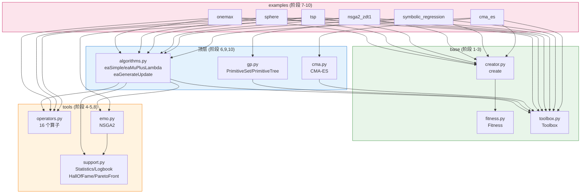
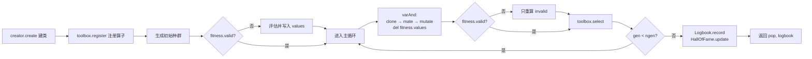

# mini_deap

> DEAP 进化算法库的**教学重写**——把核心源码简化重写一遍，保留设计思想，砍掉非教学细节。

**10/10 阶段全部完成 · 158 测试全过 · 6 个可运行例子 · 10 篇深度文档**

> 🌐 **在线阅读**：<https://wanglh39.github.io/mini_deap/>
>
> 配有深浅色切换、全文搜索、mermaid 架构图渲染、代码一键复制。改 `docs/` 下任何 markdown 并 push，网站自动重建。

---

## 为什么有这个项目

DEAP 是 Python 最流行的进化算法库，但源码里混着大量工业级鲁棒性补丁，初学者很难看清"为什么这么设计"。`mini_deap` 把它的核心**重写**一遍，每阶段一个模块 + 一份 300+ 行讲解文档 + 单测，让你顺着 10 个阶段就能理解整个库的骨架。

## 5 大核心设计思想

| # | 思想 | 体现位置 | 一句话 |
|---|---|---|---|
| 1 | **数据与算法解耦** | `Toolbox` | 个体是纯数据，算子是纯函数，Toolbox 用 `partial` 粘合，算法只认别名 |
| 2 | **统一 max/min** | `Fitness.weights` | weights 正负编码方向，比较只比 `wvalues`，零分支 |
| 3 | **惰性求值** | `fitness.valid` | 变异后 `del values` 失效，每代只重算 invalid 个体 |
| 4 | **元编程建类** | `creator.create` | 一行动态建"带 fitness 的 list 子类"，适配任意表示 |
| 5 | **并行/拷贝友好** | `toolbox.map` / `__deepcopy__` | 换 map 即并行，自定义 deepcopy 提速 |

## 架构图

### 模块依赖



### 运行时数据流（一次 `eaSimple` 主循环）



## 快速上手

```powershell
# Python 3.13.5（conda base），已装 deap 1.4 / pytest 8.3.4 / numpy 2.1.3
$py = "python"

# 跑全部 158 个测试
& $py -m pytest

# 跑一个例子
& $py -m mini_deap.examples.onemax
```

一个最简 GA（One-Max）长这样：

```python
from mini_deap.base import Fitness, Toolbox
from mini_deap.base.creator import create
from mini_deap.tools import initRepeat, selTournament, cxOnePoint, mutFlipBit
from mini_deap.algorithms import eaSimple

create("Ind", list, fitness=Fitness(weights=(1.0,)))

tb = Toolbox()
tb.register("attr", lambda: random.randint(0, 1))
tb.register("individual", initRepeat, Ind, tb.attr, n=100)
tb.register("population", initRepeat, list, tb.individual, n=300)
tb.register("evaluate", lambda ind: (sum(ind),))   # 必须返回 tuple
tb.register("mate", cxOnePoint)
tb.register("mutate", mutFlipBit, indpb=0.05)
tb.register("select", selTournament, tournsize=3)

pop = tb.population()
eaSimple(pop, tb, cxpb=0.5, mutpb=0.2, ngen=40, stats=None, halloffame=None, verbose=True)
```

## 例子

| 例子 | 算法 | 问题 | 典型结果 | 命令 |
|---|---|---|---|---|
| `onemax` | GA | 100 位串 One-Max | 50/50 完美解 | `python -m mini_deap.examples.onemax` |
| `sphere` | μ+λ ES | 10 维 Sphere | ≈ 0.000362 | `python -m mini_deap.examples.sphere` |
| `tsp` | GA | 10 城 TSP | ≈ 773.05 | `python -m mini_deap.examples.tsp` |
| `nsga2_zdt1` | NSGA2 | ZDT1 双目标 | Pareto 前沿显现 | `python -m mini_deap.examples.nsga2_zdt1` |
| `symbolic_regression` | GP | 符号回归 | MSE ≈ 0.24 | `python -m mini_deap.examples.symbolic_regression` |
| `cma_es` | CMA-ES | Sphere / Rosenbrock | 0.0001 / 6.33 | `python -m mini_deap.examples.cma_es` |

## 10 阶段进度

| 阶段 | 模块 | 测试 | 状态 |
|---|---|---:|---|
| 0 | 项目骨架 | — | ✅ |
| 1 | `base/fitness.py` | 20 | ✅ |
| 2 | `base/toolbox.py` | 13 | ✅ |
| 3 | `base/creator.py` | 15 | ✅ |
| 4 | `tools/operators.py` | 22 | ✅ |
| 5 | `tools/support.py` | 13 | ✅ |
| 6 | `algorithms.py` | 24 | ✅ |
| 7 | `examples/` One-Max+Sphere+TSP | — | ✅ |
| 8 | `tools/emo.py` NSGA2 | 18 | ✅ |
| 9 | `gp.py` 符号回归 | 25 | ✅ |
| 10 | `cma.py` CMA-ES | 8 | ✅ |

## 文档索引

每篇 300+ 行，结构：背景 → 设计哲学 → 逐段精读 → deap 对照 → 简化说明 → 常见陷阱 → Python 特性备忘 → 思考题。

| 文档 | 内容 |
|---|---|
| [00_overview.md](docs/00_overview.md) | 总览（6 张架构图 + 完整进度 + 取舍说明） |
| [01_fitness.md](docs/01_fitness.md) | Fitness：weights 编码方向、惰性求值 |
| [02_toolbox.md](docs/02_toolbox.md) | Toolbox：partial 冻参、别名抽象 |
| [03_creator.md](docs/03_creator.md) | creator：元编程动态建类 |
| [04_operators.md](docs/04_operators.md) | 16 个算子 + numpy 对照版 |
| [05_support.md](docs/05_support.md) | Statistics/Logbook/HallOfFame/ParetoFront |
| [06_algorithms.md](docs/06_algorithms.md) | varAnd/varOr/eaSimple/eaMuPlusLambda |
| [07_examples.md](docs/07_examples.md) | One-Max/Sphere/TSP 串联验收 |
| [08_nsga2.md](docs/08_nsga2.md) | 非支配排序 + 拥挤距离 + SBX |
| [09_gp.md](docs/09_gp.md) | GP 树表示 + compile + 交叉变异 |
| [10_cma.md](docs/10_cma.md) | CMA-ES ask-tell + 协方差矩阵学习 |

## 目录结构

```
mini_deap/
├── base/        # Fitness / Toolbox / creator  (阶段 1-3)
├── tools/       # 算子 / 统计 / NSGA2         (阶段 4-5,8)
├── algorithms.py# 算法骨架                    (阶段 6)
├── gp.py        # 遗传编程                     (阶段 9)
├── cma.py       # CMA-ES                       (阶段 10)
└── examples/    # 6 个可运行例子              (阶段 7-10)
tests/           # 158 测试全过
docs/            # 10 篇深度文档
```

## 与原版 DEAP 的取舍

**保留**：5 大设计思想全部保留 · `Fitness`/`Toolbox`/`creator` 完整语义 · 16 个常用算子 · NSGA2 完整流程 · GP 树表示+编译 · CMA-ES 完整更新 · 4 种算法骨架

**简化**：砍掉基准测试套件、冷门算子、NSGA3/SPEA2/MOEA/D、IPOP-CMA-ES、有界约束处理、`Logbook` 美化、`HallOfFame` 相似性去重、`alias` 冲突检测

一句话：**保留"为什么这么设计"，简化"工业级鲁棒性补丁"**。

## 参考

- 原版 DEAP：<https://github.com/DEAP/deap>（对照源码在 `Lib/site-packages/deap`）
- 本项目讲解 skill：`.codearts/skills/mini-deap-tutorial/SKILL.md`（5 种讲解模式）

## License

教学项目，仅供学习参考。