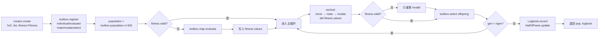
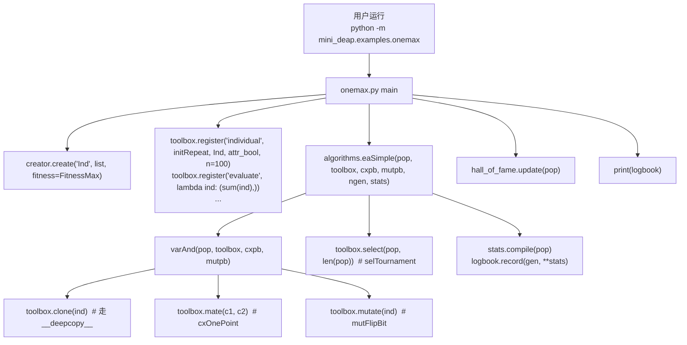
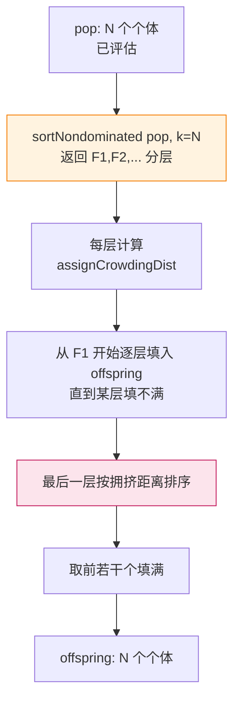
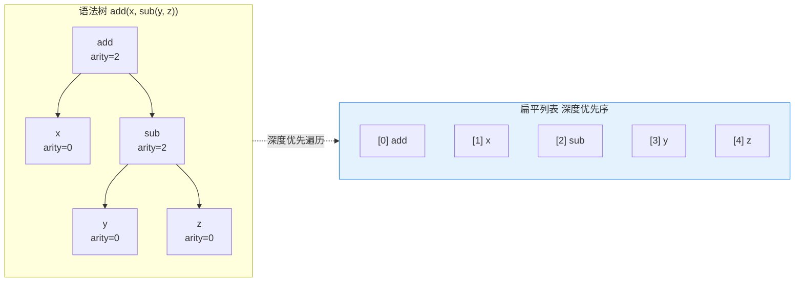
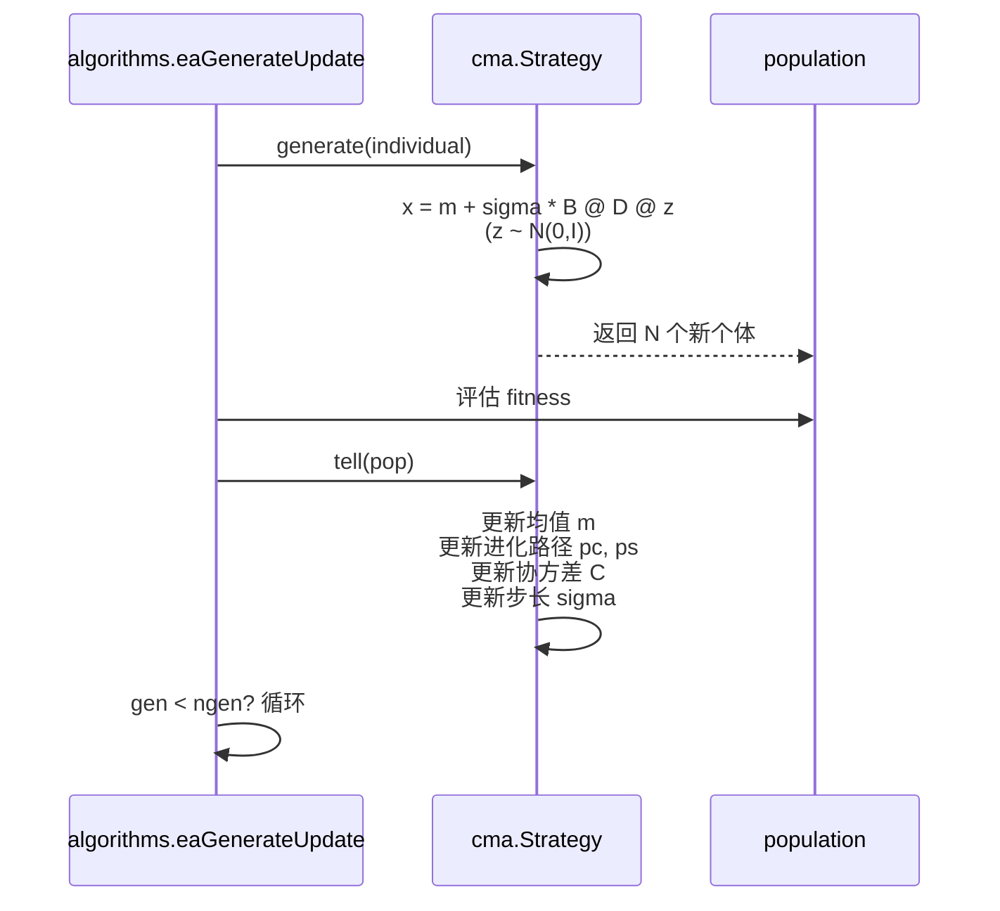

# mini_deap —— DEAP 进化算法库教学重写 · 总览

> 目标：把 DEAP 的核心源码**简化重写**一遍，保留设计思想，砍掉非教学细节。
> 每阶段一个模块 + 一份 markdown 讲解 + 单测，一阶段一确认，最后串联实战。

**当前状态：10/10 阶段全部完成 · 158 测试全过 · 6 个可运行例子 · 10 篇文档 · 已推送 GitHub**

- 仓库：<https://github.com/wanglh39/mini_deap>
- Python：3.13.5（conda base） · deap 1.4（对照参考） · pytest 8.3.4 · numpy 2.1.3

---

## 一、DEAP 的 5 大核心设计思想（全项目主线）

| # | 思想 | 体现位置 | 一句话 |
|---|---|---|---|
| 1 | **数据与算法解耦** | `Toolbox` | 个体是纯数据，算子是纯函数，Toolbox 用 `partial` 粘合，算法只认别名 |
| 2 | **统一 max/min** | `Fitness.weights` | weights 正负编码方向，比较只比 `wvalues`，零分支 |
| 3 | **惰性求值** | `fitness.valid` | 变异后 `del values` 失效，每代只重算 invalid 个体 |
| 4 | **元编程建类** | `creator.create` | 一行动态建"带 fitness 的 list 子类"，适配任意表示 |
| 5 | **并行/拷贝友好** | `toolbox.map` / `__deepcopy__` | 换 map 即并行，自定义 deepcopy 提速 |

---

## 二、10 阶段任务规划与进度

| 阶段 | 模块 | 对应 deap | 测试数 | 状态 |
|---|---|---|---:|---|
| 0 | 项目骨架 | — | — | ✅ 完成 |
| 1 | `base/fitness.py` | `base.Fitness` | 20 | ✅ 完成 |
| 2 | `base/toolbox.py` | `base.Toolbox` | 13 | ✅ 完成 |
| 3 | `base/creator.py` | `creator.create` | 15 | ✅ 完成 |
| 4 | `tools/operators.py` | `tools/{init,selection,crossover,mutation}` | 22 | ✅ 完成 |
| 5 | `tools/support.py` | `tools.support` | 13 | ✅ 完成 |
| 6 | `algorithms.py` | `algorithms` | 24 | ✅ 完成 |
| 7 | `examples/` One-Max+Sphere+TSP | — | — | ✅ 完成（串联） |
| 8 | `tools/emo.py` + ZDT1 | `tools.emo` NSGA2 | 18 | ✅ 完成（进阶） |
| 9 | `gp.py` + 符号回归 | `gp` | 25 | ✅ 完成（进阶） |
| 10 | `cma.py` + Sphere | `cma` | 8 | ✅ 完成（进阶） |

**测试合计：20+13+15+22+13+24+18+25+8 = 158，全部通过。**

---

## 三、项目架构图

### 图 1 · 模块依赖关系（编译期 import）

```mermaid
graph TD
    subgraph base["mini_deap/base  (阶段 1-3)"]
        fitness[fitness.py<br/>Fitness 类]
        toolbox[toolbox.py<br/>Toolbox 类]
        creator[creator.py<br/>create/MetaCreator]
    end

    subgraph tools["mini_deap/tools  (阶段 4-5,8)"]
        operators[operators.py<br/>16 个算子<br/>含 numpy 对照版]
        support[support.py<br/>Statistics/Logbook<br/>HallOfFame/ParetoFront]
        emo[emo.py<br/>NSGA2: 非支配排序<br/>拥挤距离/SBX/多项式变异]
    end

    subgraph top["mini_deap 顶层 (阶段 6,9,10)"]
        algorithms[algorithms.py<br/>varAnd/varOr<br/>eaSimple/eaMuPlusLambda<br/>eaMuCommaLambda/eaGenerateUpdate]
        gp[gp.py<br/>PrimitiveSet/PrimitiveTree<br/>compile/cxOnePoint/mutUniform]
        cma[cma.py<br/>Strategy CMA-ES<br/>ask-tell 接口]
    end

    subgraph examples["mini_deap/examples  (阶段 7-10)"]
        onemax[onemax.py<br/>One-Max GA]
        sphere[sphere.py<br/>Sphere μ+λ]
        tsp[tsp.py<br/>TSP 排列编码]
        nsga2[nsga2_zdt1.py<br/>NSGA2 ZDT1]
        symreg[symbolic_regression.py<br/>GP 符号回归]
        cmaex[cma_es.py<br/>CMA-ES]
    end

    creator -->|import| fitness
    algorithms -->|import| toolbox
    algorithms -->|import| operators
    algorithms -->|import| support
    algorithms -->|import| emo
    emo -->|import| support
    gp -->|import| toolbox
    cma -->|import| toolbox

    onemax --> algorithms
    onemax --> creator
    onemax --> toolbox
    onemax --> operators
    onemax --> support
    sphere --> algorithms
    sphere --> creator
    sphere --> toolbox
    sphere --> operators
    sphere --> support
    tsp --> algorithms
    tsp --> creator
    tsp --> toolbox
    tsp --> operators
    tsp --> support
    nsga2 --> algorithms
    nsga2 --> creator
    nsga2 --> toolbox
    nsga2 --> emo
    nsga2 --> support
    symreg --> algorithms
    symreg --> creator
    symreg --> toolbox
    symreg --> gp
    symreg --> support
    cmaex --> algorithms
    cmaex --> creator
    cmaex --> toolbox
    cmaex --> cma
    cmaex --> support

    classPathStyle fill:#e8f5e9,stroke:#388e3c
    classPathStyle2 fill:#fff3e0,stroke:#f57c00
    classPathStyle3 fill:#e3f2fd,stroke:#1976d2
    classPathStyle4 fill:#fce4ec,stroke:#c2185b
    class base classPathStyle
    class tools classPathStyle2
    class top classPathStyle3
    class examples classPathStyle4
```

**读图要点**：`base/` 是地基（无内部依赖），`tools/` 是算子库（只依赖 `base`），`algorithms/gp/cma` 是算法骨架（依赖 `base+tools`），`examples/` 是粘合层（把所有零件装配成一个可运行实验）。注意 `creator` 不依赖 `toolbox`——建类和注册算子是两件独立的事。

### 图 2 · 运行时数据流（一次 `eaSimple` 主循环）



**读图要点**：菱形 `{fitness.valid?}` 出现两次——这就是"惰性求值"在算法里的两个落点：初始评估跳过已 valid 的、变异后只重算失效的。`del fitness.values` 是触发失效的开关（`__delitem__` 把 `valid` 置 False）。

### 图 3 · 调用层次（以 One-Max 为例，自顶向下）



**读图要点**：`onemax.py` 这一个文件就调用了 `creator`/`toolbox`/`algorithms`/`operators`/`support` 五大模块——这就是"阶段 7 串联验收点"的含义：能看懂这个例子，就理解了整个库的协作方式。

### 图 4 · NSGA2 选择内部流程（阶段 8）



**读图要点**：NSGA2 的精髓在两个橙色/粉色节点——非支配排序（`F1,F2,...`）决定"谁更好"，拥挤距离（`Last`）决定"同层里保留谁以维持多样性"。两者都是**纯数据操作**，不碰算法主循环——这正是设计思想 1（数据与算法解耦）的胜利。

### 图 5 · GP 树的扁平表示（阶段 9）



**读图要点**：GP 把树压成一个一维 list（右图），用 arity 累积就能定位任意子树范围（`searchSubTree`）。`compile` 再用 `eval` 把这个 list 编译成可调用的 lambda——一行代码完成"树→函数"的跨越。

### 图 6 · CMA-ES ask-tell 接口（阶段 10）



**读图要点**：CMA-ES 不用选择/交叉/变异三件套，而是 `generate`（采样）+ `tell`（更新分布参数）。`eaGenerateUpdate` 是为这种"分布进化"专门写的算法骨架——同一套 `algorithms.py` 既能跑传统 GA，也能跑 CMA-ES，靠的就是 `toolbox` 别名抽象。

---

## 四、目录结构

```
deap/
├── .codearts/skills/mini-deap-tutorial/SKILL.md   # 讲解 skill（5 种讲解模式）
├── .gitignore
├── pytest.ini
├── mini_deap/
│   ├── __init__.py
│   ├── algorithms.py          # 阶段6: varAnd/varOr/eaSimple/eaMuPlusLambda/eaMuCommaLambda/eaGenerateUpdate
│   ├── gp.py                  # 阶段9: Primitive/Terminal/PrimitiveSet/PrimitiveTree/compile/cxOnePoint/mutUniform
│   ├── cma.py                 # 阶段10: CMA-ES Strategy 类（ask-tell）
│   ├── base/
│   │   ├── __init__.py
│   │   ├── fitness.py         # 阶段1: Fitness 类（weights 编码方向、惰性求值）
│   │   ├── toolbox.py         # 阶段2: Toolbox 类（register 用 partial 冻参）
│   │   └── creator.py         # 阶段3: create/MetaCreator（元编程建类）
│   ├── tools/
│   │   ├── __init__.py        # from .operators/support/emo import *
│   │   ├── operators.py       # 阶段4: 16 个算子（initRepeat/selTournament/cxOnePoint/mutFlipBit... 含 numpy 对照版）
│   │   ├── support.py         # 阶段5: Statistics/MultiStatistics/Logbook/HallOfFame/ParetoFront
│   │   └── emo.py             # 阶段8: NSGA2 sortNondominated/assignCrowdingDist/selNSGA2/SBX/多项式变异
│   └── examples/
│       ├── __init__.py
│       ├── onemax.py          # 阶段7: One-Max 位串 GA
│       ├── sphere.py          # 阶段7: Sphere 连续优化 (μ+λ)
│       ├── tsp.py             # 阶段7: TSP 排列编码（自定义 OX 交叉+交换变异）
│       ├── nsga2_zdt1.py      # 阶段8: NSGA2 多目标 ZDT1
│       ├── symbolic_regression.py  # 阶段9: GP 符号回归
│       └── cma_es.py          # 阶段10: CMA-ES Sphere+Rosenbrock
├── tests/                     # 158 测试全过
│   ├── base/{test_fitness,test_toolbox,test_creator}.py
│   ├── tools/{test_operators,test_support,test_emo}.py
│   ├── test_algorithms.py
│   ├── test_gp.py
│   └── test_cma.py
└── docs/                      # 10 篇文档（300+行/篇）
    ├── 00_overview.md         # 本文件
    ├── 01_fitness.md
    ├── 02_toolbox.md
    ├── 03_creator.md
    ├── 04_operators.md
    ├── 05_support.md
    ├── 06_algorithms.md
    ├── 07_examples.md
    ├── 08_nsga2.md
    ├── 09_gp.md
    └── 10_cma.md
```

---

## 五、例子运行结果速查

| 例子 | 算法 | 问题 | 典型结果 | 命令 |
|---|---|---|---|---|
| `onemax` | GA (eaSimple) | 100 位串 One-Max | 50/50 完美解 | `python -m mini_deap.examples.onemax` |
| `sphere` | μ+λ ES | 10 维 Sphere | ≈ 0.000362 | `python -m mini_deap.examples.sphere` |
| `tsp` | GA (eaSimple) | 10 城 TSP | ≈ 773.05 | `python -m mini_deap.examples.tsp` |
| `nsga2_zdt1` | NSGA2 | ZDT1 双目标 | Pareto 前沿形状显现 | `python -m mini_deap.examples.nsga2_zdt1` |
| `symbolic_regression` | GP | 符号回归 | MSE ≈ 0.24 | `python -m mini_deap.examples.symbolic_regression` |
| `cma_es` | CMA-ES | Sphere / Rosenbrock | 0.0001 / 6.33 | `python -m mini_deap.examples.cma_es` |

---

## 六、如何运行

```powershell
# Python 解释器：conda base 的 Python 3.13.5
$py = python  # 替换为你的 Python 解释器路径

# 跑全部测试（158 个）
& $py -m pytest

# 跑某阶段测试
& $py -m pytest tests/base/test_fitness.py -v
& $py -m pytest tests/tools/test_emo.py -v
& $py -m pytest tests/test_gp.py -v

# 跑某实战例子
& $py -m mini_deap.examples.onemax
& $py -m mini_deap.examples.nsga2_zdt1
& $py -m mini_deap.examples.cma_es
```

---

## 七、阅读顺序建议

1. 读 `docs/01_fitness.md` → 打开 `mini_deap/base/fitness.py` 对照
2. 依次推进，每阶段先读 docs 再读代码再读测试
3. 阶段 7 三个例子（onemax/sphere/tsp）是全库串联的"验收点"，重点看
4. 阶段 8-10 是进阶：NSGA2（多目标）、GP（树表示）、CMA-ES（分布进化），各自独立可跳读
5. 想快速理解全局时，回到本文档的**图 1 模块依赖图**和**图 2 数据流图**

---

## 八、与原版 DEAP 的取舍说明

| 保留 | 简化 |
|---|---|
| 5 大设计思想全部保留 | 砍掉 `bt/`（基准测试套件）、`psets`（预置问题集） |
| `Fitness`/`Toolbox`/`creator` 完整语义 | `creator` 不做继承链深度校验、不处理 `register` 的 `alias` 冲突检测 |
| 16 个常用算子（含 numpy 对照版） | 砍掉 `selDoubleTournament`、`cxMessyOnePoint` 等冷门算子 |
| `Statistics`/`Logbook`/`HallOfFame`/`ParetoFront` | `Logbook` 不做 header 对齐美化，`HallOfFame` 不做相似性去重 |
| NSGA2 完整流程（非支配排序+拥挤距离+SBX+多项式变异） | 砍掉 NSGA3、SPEA2、MOEA/D |
| GP 树表示+编译+交叉+变异 | 砍掉 `mutEphemeral`、`genHalfAndHalf` 之外的多种树生成策略、多参数 PrimitiveSet |
| CMA-ES 完整 `(mu,lambda)` 更新 | 砍掉 IPOP-CMA-ES（重启策略）、有界约束处理 |
| `eaSimple`/`eaMuPlusLambda`/`eaMuCommaLambda`/`eaGenerateUpdate` | 砍掉 `varAnd` 之外的批量变异接口、`eaStop` 回调机制 |

**一句话**：mini_deap 保留的是"为什么这么设计"，简化的是"工业级鲁棒性补丁"。
