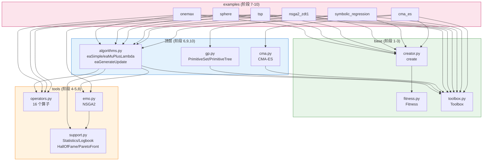

# mini_deap

> DEAP 进化算法库的**教学重写**——把核心源码简化重写一遍，保留设计思想，砍掉非教学细节。

**10/10 阶段全部完成 · 158 测试全过 · 6 个可运行例子 · 10 篇深度文档**

!!! info "这是什么"
    DEAP 是 Python 最流行的进化算法库，但源码里混着大量工业级鲁棒性补丁，初学者很难看清"为什么这么设计"。`mini_deap` 把它的核心**重写**一遍，每阶段一个模块 + 一份 300+ 行讲解文档 + 单测，让你顺着 10 个阶段就能理解整个库的骨架。

---

## 5 大核心设计思想

| # | 思想 | 体现位置 | 一句话 |
|---|---|---|---|
| 1 | **数据与算法解耦** | `Toolbox` | 个体是纯数据，算子是纯函数，Toolbox 用 `partial` 粘合，算法只认别名 |
| 2 | **统一 max/min** | `Fitness.weights` | weights 正负编码方向，比较只比 `wvalues`，零分支 |
| 3 | **惰性求值** | `fitness.valid` | 变异后 `del values` 失效，每代只重算 invalid 个体 |
| 4 | **元编程建类** | `creator.create` | 一行动态建"带 fitness 的 list 子类"，适配任意表示 |
| 5 | **并行/拷贝友好** | `toolbox.map` / `__deepcopy__` | 换 map 即并行，自定义 deepcopy 提速 |

---

## 模块依赖架构



---

## 10 阶段学习路径

| 阶段 | 模块 | 测试 | 文档 |
|---|---|---:|---|
| 0 | 项目骨架 | — | [总览](00_overview.md) |
| 1 | `base/fitness.py` | 20 | [阶段 1 · Fitness](01_fitness.md) |
| 2 | `base/toolbox.py` | 13 | [阶段 2 · Toolbox](02_toolbox.md) |
| 3 | `base/creator.py` | 15 | [阶段 3 · Creator](03_creator.md) |
| 4 | `tools/operators.py` | 22 | [阶段 4 · 算子库](04_operators.md) |
| 5 | `tools/support.py` | 13 | [阶段 5 · support](05_support.md) |
| 6 | `algorithms.py` | 24 | [阶段 6 · algorithms](06_algorithms.md) |
| 7 | `examples/` | — | [阶段 7 · examples](07_examples.md) |
| 8 | `tools/emo.py` NSGA2 | 18 | [阶段 8 · NSGA2](08_nsga2.md) |
| 9 | `gp.py` 符号回归 | 25 | [阶段 9 · GP](09_gp.md) |
| 10 | `cma.py` CMA-ES | 8 | [阶段 10 · CMA-ES](10_cma.md) |

**测试合计：158，全部通过。**

---

## 例子速查

| 例子 | 算法 | 问题 | 典型结果 |
|---|---|---|---|
| `onemax` | GA | 100 位串 One-Max | 50/50 完美解 |
| `sphere` | μ+λ ES | 10 维 Sphere | ≈ 0.000362 |
| `tsp` | GA | 10 城 TSP | ≈ 773.05 |
| `nsga2_zdt1` | NSGA2 | ZDT1 双目标 | Pareto 前沿显现 |
| `symbolic_regression` | GP | 符号回归 | MSE ≈ 0.24 |
| `cma_es` | CMA-ES | Sphere / Rosenbrock | 0.0001 / 6.33 |

---

## 快速上手

```powershell
# Python 3.13.5（conda base），已装 deap 1.4 / pytest 8.3.4 / numpy 2.1.3
$py = "python"

# 跑全部 158 个测试
& $py -m pytest

# 跑一个例子
& $py -m mini_deap.examples.onemax
```

!!! tip "阅读顺序"
    1. 读 [总览](00_overview.md) 理解全局架构
    2. 依次推进 10 个阶段，每阶段先读 docs 再读代码再读测试
    3. 阶段 7 三个例子是全库串联的"验收点"，重点看
    4. 阶段 8-10 是进阶，各自独立可跳读

---

## 与原版 DEAP 的取舍

**保留**：5 大设计思想全部保留 · `Fitness`/`Toolbox`/`creator` 完整语义 · 16 个常用算子 · NSGA2 完整流程 · GP 树表示+编译 · CMA-ES 完整更新 · 4 种算法骨架

**简化**：砍掉基准测试套件、冷门算子、NSGA3/SPEA2/MOEA/D、IPOP-CMA-ES、有界约束处理、`Logbook` 美化、`HallOfFame` 相似性去重

一句话：**保留"为什么这么设计"，简化"工业级鲁棒性补丁"**。

---

!!! quote "参考"
    - 原版 DEAP：<https://github.com/DEAP/deap>
    - 本项目源码：<https://github.com/wanglh39/mini_deap>